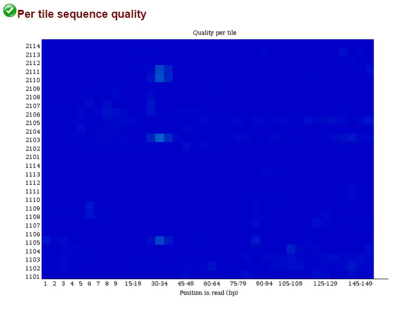
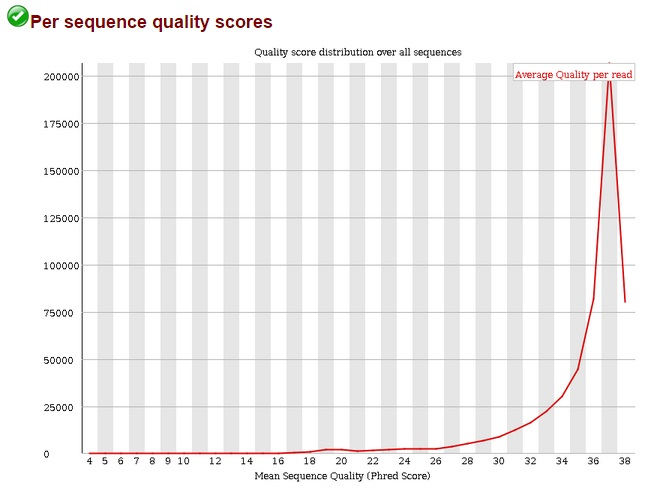
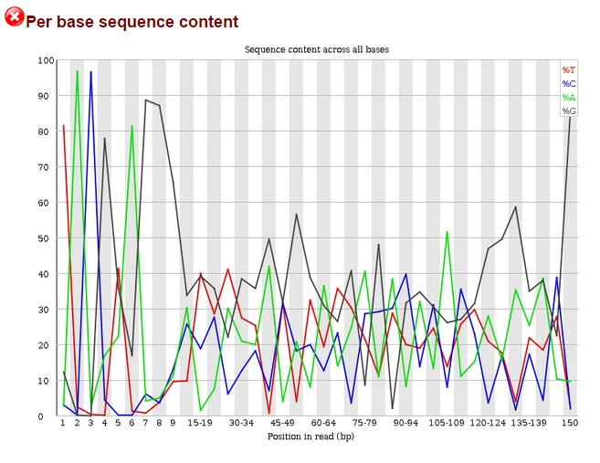
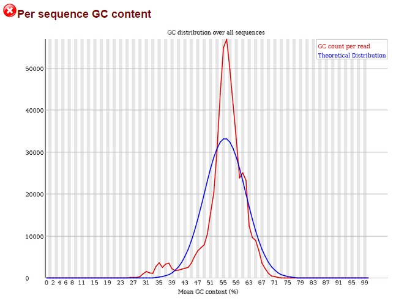
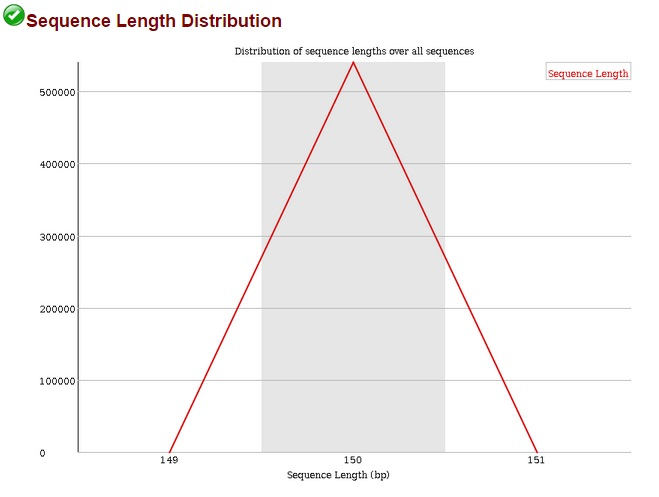
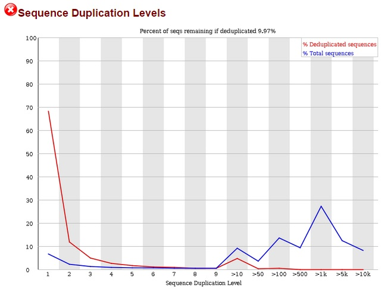
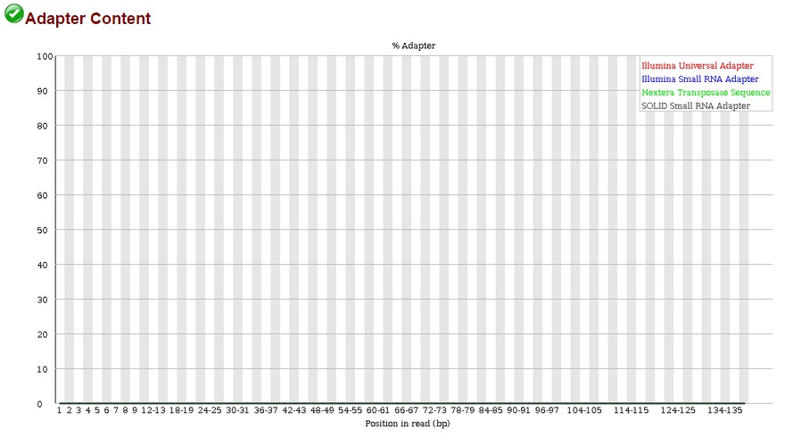
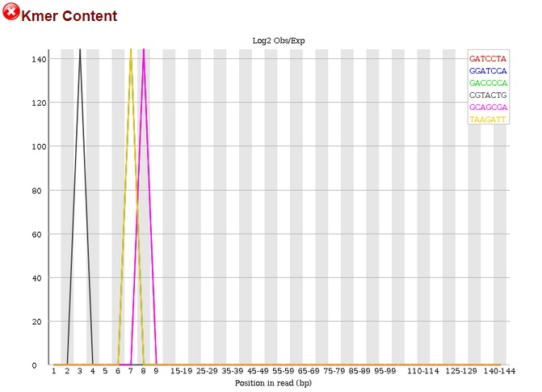

#Data quality checking with FastQC

####Information in this tutorial is based on the FastQC manual which can be accessed [here](http://www.bioinformatics.babraham.ac.uk/projects/fastqc/Help/).

FastQC is a relatively quick and labor-un-intesive way to check the quality of your Illumina sequencing data.

Before starting, we need to make sure we have sequencing files that end in .fastq

FastQC is already loaded and active in our AMI, so all we have to do is use the 'fastqc' command:
```
fastqc C02_05102014_R1_D03_TTACTGTGCGAT.fastq
```
This will create two new files with the same name and the extensions `.fastqc.zip` and `fastqc.html`. As you may be able to guess, these are processed files in zip and html format. 

Using scp, transfer the html file to your desktop. Now double-click on the file and it should open in your browser. 


###1: Basic Statistics


Basic statistics is a chart containing information about your file, including the name, how many reads were analyzed, and whether or not any of the reads were flagged for poor quality. 

###2: Per base sequence quality


Per base sequence quality is exactly what it sounds like: a graph displaying the quality of each sequence at every base. It displays this information using box and whisker plots to give you a sense of how much variation there was among the reads. Any plot that is within the green region is considered acceptable quality, while anything in the orange or red regions is not. 

###3: Per tile sequence quality


Per tile sequence quality is a measure of the flow cell quality by individual tiles. If the figure is entirely a solid bright blue, the flow cell tile quality was consistently great! If there are patches of lighter blue or any other color, there was a problem associated with one of the tiles and this may correspond with a decrease in sequence quality in those regions.

###4: Per sequence quality scores


Per sequence quality scores reprent the quality of each read for the sequence. Some of the reads may be of poor quality due to positioning within the flow cell.

###5: Per base sequence content


Per base sequence content shows, for each position of every sequence, the base composition as a percentage of As, Ts, Cs and Gs. In a typical genome we expect the percentages of each base to be roughly equal, so the lines should be parallel and within about 10% of each other. 

###6: Per sequence GC content


Per sequence GC content displays the GC content for all reads along with the "theoretical distribution" of GCs. The peak of the red line corresponds to the mean GC content for the sequences, while the peak of the blue line corresponds to the theoretical mean GC content. Your GC content should be normally distributed; shifts in the peak are to be expected since GC content varies between organisms, but anything other than a normal curve might be indicative of contamination.

###7: Per base N content


Per base N content shows any positions within the sequences which have not been called as A, T, C or G. Ideally the per base N content will be a completely flat line at 0% on the y-axis, indicating that all bases have been called with a certain level of confidence. 

###8: Sequence length distribution


This is simply showing the length of each sequence. They should all be the same size, with a couple of bp variation being acceptable. 

###9: Sequence duplication levels


The sequence duplication levels plot shows the number of times a sequence is duplicated on the x-axis with the percent of sequences showing this duplication level on the y-axis. Normally a genome will have a sequence duplication level of 1 to 3 for the majority of sequences, with only a handful having a duplication level higher than this; the line should have an inverse log shape. A high duplication level for a large percentage of sequences is usually indicative of contamination. 

###10: Overrepresented sequences


If a certain sequence is calculated to represent more than 0.1% of the entire genome, it will be flagged as an overrepresented sequence. A frequent source of "overrepresented sequences" is in fact Illumina adapters, which is why it's a good idea to trim sequences before running FastQC. Another occasional source of overrepresented sequences is high copy-number plasmids. FastQC checks for possible matches to these overrepresented sequences, although this search frequently returns "no hit". However it is usually quite easy to identify the overrepresented sequences by doing a simple BLAST search.


###11: Adapter content



###12: Kmer content



