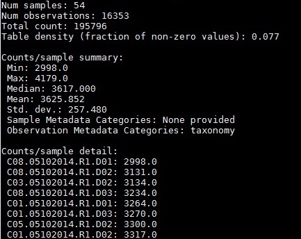
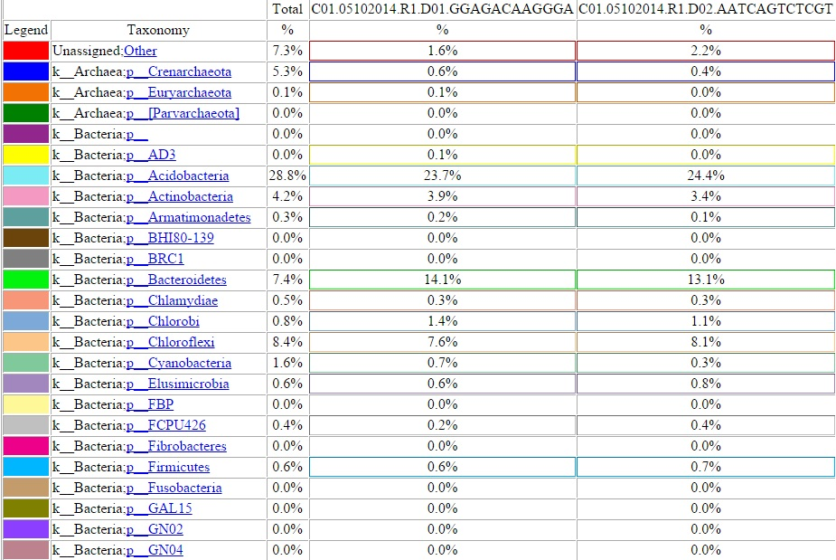

Authored by Ashley Shade, with contributions by Sang-Hoon Lee and Siobhan Cusack

###Handouts of workflow charts are available for the QIIME workflow discussed in these tutorials:
-  [Paired-End Illumina](https://github.com/edamame-course/docs/tree/gh-pages/extra/Handouts/QIIMEFlowChart_IlluminaPairedEnds_13aug2014.pdf?raw=true)
-  [454](https://github.com/edamame-course/docs/tree/gh-pages/extra/Handouts/QIIMEFlowChart_454_13aug2014.pdf?raw=true)

## Welcome back, Microbe Enthusiasts!

## Creating an OTU table in QIIME

Previously, we left off with quality-controlled merged Illumina paired-end sequences, picked OTUs and an alignment of the representative sequences from those OTUs.

### 3.1  Assign taxonomy to representative sequences (now done with pick_open_reference_otus)

Navigate into the QIIMETutorial directory using `cd`, and, enter the QIIME environment. We will use the RDP classifier with a greengenes 16S rRNA reference database (both default options in QIIME).  This script will take a few minutes to run on a lap-top. Documentation is [here](http://qiime.org/scripts/assign_taxonomy.html).

```
assign_taxonomy.py -i usearch61_openref/rep_set.fna -m rdp -c 0.8
```

Navigate into the new rdp_assigned_taxonomy directory and inspect the head of the tax_assignments file.

```
head usearch61_openref/uclust_assigned_taxonomy/rep_set_tax_assignments.txt
```


This assignment file is used anytime an OTU ID (the number) needs to be linked with its taxonomic assignment.
*Note* that this list of OTUs and taxonomic assignments includes our "failed-to-align" representative sequences.  We will remove these at the next step.

### 3.2  Make an OTU table, append the assigned taxonomy, and exclude failed alignment OTUs (now done with pick_open_reference_otus)

The OTU table is the table on which all ecological analyses (e.g. diversity, patterns, etc) are performed.  However, building the OTU table is relatively straightforward (you just count how many of each OTU was observed in each sample).  Instead, every step up until building the OTU table is important.  The algorithms that are chosen to assemble reads, quality control reads, define OTUs, etc are all gearing up to this one summarization. Documentation for make_otu_table.py is [here](http://qiime.org/scripts/make_otu_table.html). Note that the "map" file is not actually the mapping file, but the OTU cluster file (the output of pick_open_reference_otus.py).
Navigate back into the "QIIMETutorial" directory to execute the script.

```
biom summarize_table -i usearch61_openref/otu_table_mc2_w_tax.biom -o summary_otu_table_mc2_w_tax_biom.txt
```

The summary file contains information about the number of sequences per sample, which will help us to make decisions about rarefaction (subsampling).  When we inspect the file, we see that sample C03.05102014.R1.D02.CTAACCTCCGCT has 4711 reads, the minimum observed.  This is what we will use as a subsampling depth.  Also, a lot of the info in this file is typically reported in methods sections of manuscripts.




### 3.3 Make a phylogenetic tree (now done by pick_open_reference_otus)

We will make a phylogenetic tree of the short-read sequences so that we can use information about the relatedness among taxa to estimate and compare diversity.  We will use FastTree for this.  
It is best not to use trees made from short-reads as very robust hypotheses of evolution. I suggest using trees from short-read sequences for ecological analyses, visualization and hypothesis-generation rather than strict phylogenetic inference.
Documentation is [here](http://qiime.org/scripts/make_phylogeny.html).

```
mkdir fasttree_usearch61
```

```
make_phylogeny.py -i pynast_aligned/rep_set_aligned.fasta -t fasttree -o fasttree_usearch61/fasttree_usearch.tre
```

A few notables:  The tree algorithm input is the alignment file; the output extension is .tre.

Inspect the new tree file ([Newick](http://marvin.cs.uidaho.edu/Teaching/CS515/newickFormat.html) format). The OTU ID is given first, and then the branch length to the next node. This format is generally compatible with other tree-building and viewing software. For example, I have used it to input into the [Interactive Tree of Life](http://itol.embl.de/) to build visually appealing figures. [Topiary Explorer](http://topiaryexplorer.sourceforge.net/) is another options for visualization, and is a QIIME add-on.

### 3.4 Rarefaction (subsampling)

Navigate back into the QIIMETutorial directory.

Before we start any ecological analyses, we want to evenly subsample ("rarefy", but see this [discussion](http://www.ploscompbiol.org/article/info%3Adoi%2F10.1371%2Fjournal.pcbi.1003531)) all the samples to an equal ("even") number of sequences so that they can be directly compared to one another. Many heartily agree (as exampled by [Gihring et al. 2011](http://onlinelibrary.wiley.com/doi/10.1111/j.1462-2920.2011.02550.x/full)) that sample-to-sample comparisons cannot be made unless subsampling to an equal sequencing depth is performed.

To subsample the OTU table, we need to decide the appropriate subsampling depth. What is the best number of sequences?  As a rule, we must subsample to the minimum number of sequences per sample for all samples *included* in analyses.  Sometimes this is not straightforward, but here are some things to consider:

*  Are there low-sequence samples that have very few reads because there was a technological error (a bubble, poor DNA extraction, poor amplification, etc)?  These samples should be removed (and hopefully re-sequenced), especially if there is no biological explanation for the low number of reads.
*  How complex is the community?  An acid-mine drainage community is less rich than a soil, and so fewer sequences per sample are needed to evaluate diversity.
*  How exhaustive is the sequencing?  If this is unknown, an exploratory rarefaction analysis could be done to estimate.
*  How important is it to keep all samples in the analysis?  Consider the costs and benefits of, for example, dropping one not-very-well-sequenced replicate in favor of increasing overall sequence information.  If you've got $$ to spare, built-in sequencing redundancy/replication is helpful for this.
*  Don't fret!  Soon sequencing will be so inexpensive that we will be sequencing every community exhaustively and not have to worry about it anymore.

In this example dataset, we want to keep all of our samples, so we will subsample to 4711.  Documentation is [here](http://qiime.org/scripts/single_rarefaction.html?highlight=rarefaction).
Navigate back to the EDAMAME16S directory.

```
single_rarefaction.py -i usearch61_openref/otu_table_mc2_w_tax.biom -o Subsampling_otu_table_even4711.biom -d 4711
```

We append _even4711 to the end of the table to distinguish it from the full table.  This is even4711 table is the final biom table on which to perform ecological analyses.  If we run the [biom summary](http://biom-format.org/documentation/summarizing_biom_tables.html) command, we will now see that every sample in the new table has exactly the same number of sequences:

```
biom summarize_table -i Subsampling_otu_table_even4711.biom -o summary_Subsampling_otu_table_even4711.txt
head summary_Subsampling_otu_table_even4711.txt
```

Our "clean" dataset has 54 samples and 24263 OTUs defined at 97% sequence identity.

There is a [recent paper](http://www.ploscompbiol.org/article/info%3Adoi%2F10.1371%2Fjournal.pcbi.1003531) that suggests that even subsampling is not necessary, but this is very actively debated.

### 3.5 Calculating alpha (within-sample) diversity

Navigate back into the EDAMAME_16S directory, and make a new directory for alpha diversity results.

```
mkdir alphadiversity_even4711

```

We will calculate richness (observed # taxa) and phylogenetic diversity (PD) for each sample.  Documentation is [here](http://qiime.org/scripts/alpha_diversity.html).

```
alpha_diversity.py -i Subsampling_otu_table_even4711.biom -m observed_species,PD_whole_tree -o alphadiversity_even4711/alphadiversity_evensubsample_usearch61_alphadiversity_even4711.txt -t usearch61_openref/rep_set.tre
```

As always, inspect the results file.  What are the ranges that were observed in richness and PD?

```
head alphadiversity_even4711/subsample_usearch61_alphadiversity_even4711.txt
```

QIIME offers a variety of additional options for calculating diversity, and the -s option prints them all!

```
alpha_diversity.py -s
```

There is workflow script, [alpha_rarefaction.py](http://qiime.org/scripts/alpha_rarefaction.html), which is useful if you want to understand how measures of alpha diversity change with sequencing effort.  The script calculates alpha diversity on iterations of a subsampled OTU table.

### 3.6 Visualizing alpha diversity

`summarize_taxa_through_plots.py` is a QIIME workflow script that calculates summaries of OTUs at different taxonomic levels. Documentation is [here](http://qiime.org/scripts/summarize_taxa_through_plots.html). This will take about 10 minutes.

```
summarize_taxa_through_plots.py -o alphadiversity_even4711/taxa_summary4708/ -i usearch61_openref/Subsampling_otu_table_even4711.biom
```

When the script is finished, navigate into the results file, and into the "taxa_summary_plots" and find the html area and bar charts.
As you are navigating to these html files, notice that the script has produced an OTU/biom table for every taxonomic level (designated by the "L"):


The "L" stands for "lineage", and each "level" is designated by a number.  L1 is Domain, L2 is Phylum, L3 is Class, etc.  The more resolved the lineage (higher number), the less accurate the definition (e.g., L6 is not entirely and consistently the same as  "genus").

To view the HTML files, you will need to transfer the HTML files themselves and their companion files in the ```charts``` directory to your desktop using scp. Open a terminal with the working directory on your computer, not the EC2.

```
scp -i your/key/file ubuntu@ec2-your_DNS.compute-1.amazonaws.com:EDAMAME_16S/alphadiversity/alphadiversity_even4708/taxa_summary4708/taxa_summary_plots/bar_charts.html /home/your_username/Desktop

scp -i your/key/file ubuntu@ec2-your_DNS.compute-1.amazonaws.com:EDAMAME_16S/alphadiversity/alphadiversity_even4708/taxa_summary4708/taxa_summary_plots/area_charts.html /home/your_username/Desktop

scp -r -i your/key/file ubuntu@ec2-your_DNS.compute-1.amazonaws.com:EDAMAME_16S/alphadiversity/alphadiversity_even4708/taxa_summary4708/taxa_summary_plots/charts /home/your_username/Desktop

```
The last command above contains the ```-r``` flag after ```scp```. The r means "recursive", and specifies that because we have a whole directory full of files, we want scp to go back and grab all of the files there, not just one. You will get an error if you try to scp a directory without the -r flag.  

Now go to the desktop and double-click on area_charts.html and bar_charts.html. They will both look like this:



The links above and below the charts point to the raw data or other summaries.  Spend some time exploring all of the different links.

In your browser, carefully inspect and interact with these quick charts.  Though these are not publication-ready, they are a great first exploration of the taxa in the dataset.

(We will test differences in alpha diversity in R.)


## Where to find QIIME resources and help
*  [QIIME](qiime.org) offers a suite of developer-designed [tutorials](http://www.qiime.org/tutorials/tutorial.html).
*  [Documentation](http://www.qiime.org/scripts/index.html) for all QIIME scripts.
*  There is a very active [QIIME Forum](https://groups.google.com/forum/#!forum/qiime-forum) on Google Groups.  This is a great place to troubleshoot problems, responses often are returned in a few hours!
*  The [QIIME Blog](http://qiime.wordpress.com/) provides updates like bug fixes, new features, and new releases.
*  QIIME development is on [GitHub](https://github.com/biocore/qiime).


-----------------------------------------------
-----------------------------------------------
