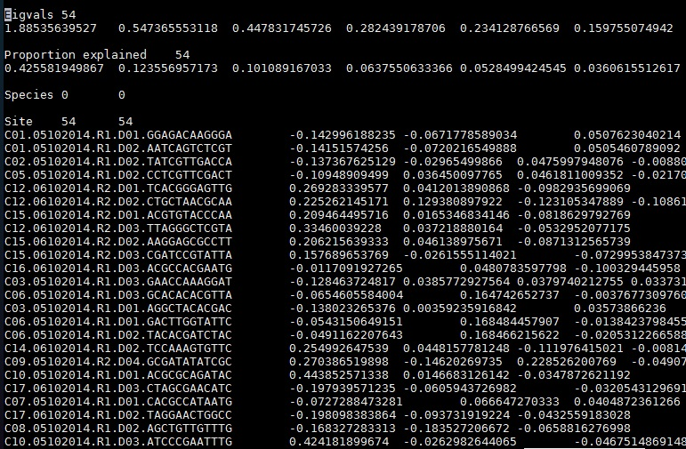
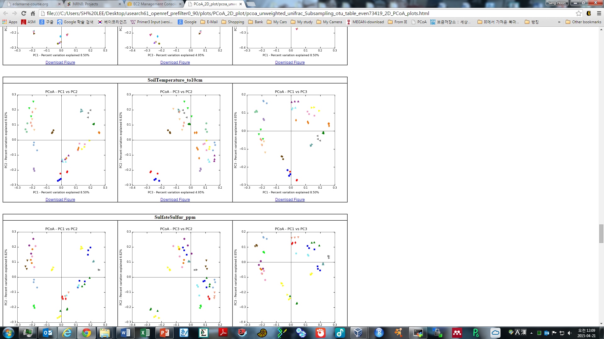

### Handouts of workflow charts are available for the QIIME workflow discussed in these tutorials:
-  [Paired-End Illumina](https://github.com/edamame-course/docs/tree/gh-pages/extra/Handouts/QIIMEFlowChart_IlluminaPairedEnds_13aug2014.pdf?raw=true)
-  [454](https://github.com/edamame-course/docs/tree/gh-pages/extra/Handouts/QIIMEFlowChart_454_13aug2014.pdf?raw=true)


## 3.1 Make resemblance matrices to analyze comparative (beta) diversity
Make sure that you are in the EDAMAME_16S directory.  

If you need the Subsampling_otu_table_even4711.biom file from Parts 1 and 2 of the tutorial you can use curl to grab it:
```
curl -O https://raw.githubusercontent.com/edamame-course/2015-tutorials/master/QIIME_files/Subsampling_otu_table_even4711.biom
```
 
We will make three kinds of resemblance matrices (sample by sample comparisons) for assessing comparative diversity.

Use the `-s` option to see all of the different options for calculating beta diversity in QIIME.

```
beta_diversity.py -s
```

To compare weighted/uweighted and phylogenetic/taxonomic metrics, we will ask QIIME to create four resemblance matrices of all of these different flavors.

```
beta_diversity.py -i Subsampling_otu_table_even4711.biom -m unweighted_unifrac,weighted_unifrac,binary_sorensen_dice,bray_curtis -o beta_div_even4711/ -t usearch61_openref/rep_set.tre
```
Due to a bug in this version of QIIME, this may return a warning that says "VisibleDeprecationWarning". Do not be alarmed! The script has still worked as it was supposed to. Navigate to the new directory called "beta_div_even4711". 

There should be four new resemblance matrices in the directory.  We're going to get all crazy and open these outside of the terminal. Use scp to transfer them to your desktop, then use Excel to inspect them and to compare their values.  This should be a square matrix, and the upper and lower triangles should be mirror-images.  The diagonal should be zero.

From a terminal with your computer as the working directory, grab all files in this directory ending in .txt, which is all of them:

```
scp -i your/key/file ubuntu@ec2-your_DNS.compute-1.amazonaws.com:EDAMAME_16S/beta_div_even4711/*.txt /home/your_username/Desktop
```
Windows users: right click on each file and go to "open with -> Excel".
Mac users: control click each file then go to "open with -> Excel" 

Pop quiz:  Why is the diagonal zero?


## 4.2 Using QIIME for visualization:  Ordination

QIIME scripts can easily make an ordination using principal components analysis (PCoA). We'll perform PCoA on all resemblance matrices, and compare them.  Documentation is [here](http://qiime.org/scripts/principal_coordinates.html).  As always, make sure you are in the QIIMETutorial directory to execute these analyses.


```
principal_coordinates.py -i beta_div_even4711/ -o beta_div_even4711_PCoA/
```

Notice that the `-i` command only specifies the directory, and not an individual filepath.  PCoA will be performed on all resemblances in that directory.  If we navigate into the new directory, we see there is one results file for each input resemblence matrix.


Inspect the one of these files using nano.

```
nano pcoa_weighted_unifrac_Subsampling_otu_table_even4711.txt
```



The first column has SampleIDs, and column names are PCoA axis scores for every dimension.  In PCoA, there are as many dimensions (axes) as there are samples. Remember that, typically, each axis explains less variability in the dataset than the previous axis.

These PCoA results files can be imported into other software for making ordinations outside of QIIME.

Navigate back into the EDAMAME_16S directory.

We can make 2d plots of the output of `principal_coordinates.py`, and map the colors to the categories in the mapping file.

```
make_2d_plots.py -i beta_div_even4711_PCoA/pcoa_weighted_unifrac_Subsampling_otu_table_even4711.txt -m MappingFiles/Centralia_Full_Map.txt -o PCoA_2D_plot/
```

Navigate into the new directory and open the html link.
```
cd PCoA_2D_plot/
```

```
open pcoa_weighted_unifrac_Subsampling_otu_table_even4711_2D_PCoA_plots.html
```



This is where  a comprehensive mapping file is priceless because any values or categories reported in the mapping file will be automatically color-coded for data exploration.  In the example above, there is an obvious difference in the community structure of the gut microbiota of the F3 mouse over time (using).

Take some time to explore these plots: toggle samples, note color categories, hover over points to examine sample IDs.  What hypotheses can be generated based on exploring these ordinations?

*Exercise*
Make 2D plots for each PCoA analysis from each of the four difference resemblance results and compare them.  How are the results different, if at all?  Would you reach difference conclusions?

[The Ordination Web Page](http://ordination.okstate.edu/) is a great resource about all the different flavors of ordination.

### 4.3  Other visualizations in QIIME
We can make a non-metric multidimensional scaling (NMDS) plot:

```
mkdir NMS_Plot
nmds.py -i beta_div_even4711/bray_curtis_Subsampling_otu_table_even4711.txt -o NMS_Plot/BC_coords.txt
```
##screenshot

We can also make a quick heatmap in QIIME, which shows the number of sequences per sample relative to one another.

```
make_otu_heatmap.py -i Subsampling_otu_table_even4711.biom -o heatmap/
```

```
open Subsampling_otu_table_even4711.html
```

Explore this visualization.  You can filter the minimum number of OTUs, filter by sample ID, or by OTU ID.  

**Visualization considerations**
QIIME visualizations are currently being re-vamped by the developers.  In the next version, there will visualization scripts that are no longer supported, in favor of new tools.  Some of these tools include co-occurence networks enabled by Cytoscape (a MacQIIME add-on), and other visualizations by [emperor](http://biocore.github.io/emperor/).  There is always something new!


### 4.4  Exporting the QIIME-created biom table for use in other software (R, Primer, Phinch, etc)
This command changes frequently, as the biom format is a work in progress.  Use `biom convert -h` to find the most up-to-date arguments and options; the web page is not updated as frequently as the help file.

```
mkdir biom_converted_even4711
biom convert -i Subsampling_otu_table_even4711.biom -o biom_converted_even4711/table.from_biom.txt --table-type "OTU table" --to-tsv

```


## Where to find QIIME resources and help
*  [QIIME](qiime.org) offers a suite of developer-designed [tutorials](http://www.qiime.org/tutorials/tutorial.html).
*  [Documentation](http://www.qiime.org/scripts/index.html) for all QIIME scripts.
*  There is a very active [QIIME Forum](https://groups.google.com/forum/#!forum/qiime-forum) on Google Groups.  This is a great place to troubleshoot problems, responses often are returned in a few hours!
*  The [QIIME Blog](http://qiime.wordpress.com/) provides updates like bug fixes, new features, and new releases.
*  QIIME development is on [GitHub](https://github.com/biocore/qiime).

-----------------------------------------------
-----------------------------------------------

