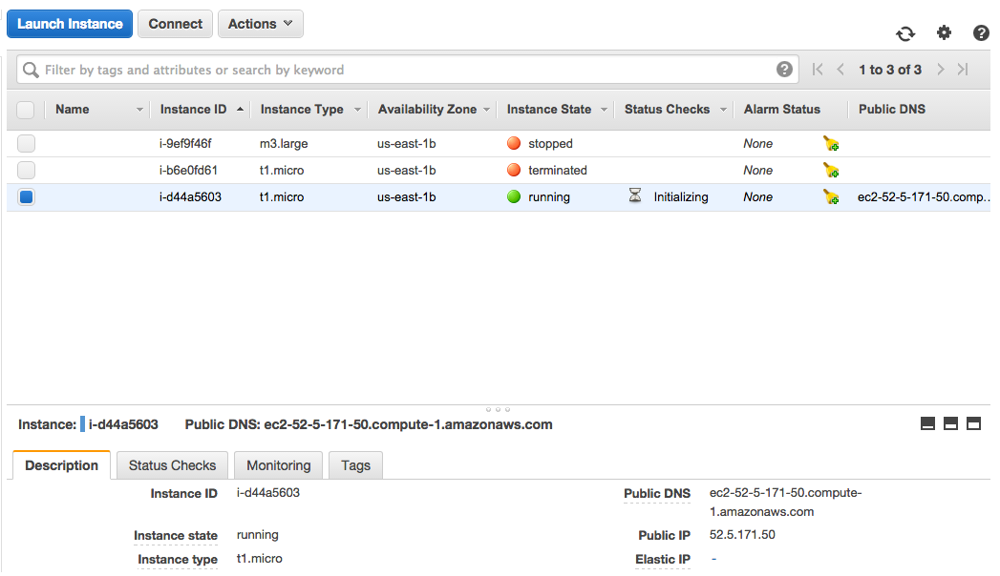

##Mac OS & Linux Users, connecting to your Amazon EC2 instance at the command line is pretty easy.
###0. Find your EC2's Public DNS:
Before you can connect to your EC2 instance you first need to find its Public DNS. This essentially acts as an address for your EC2 instance so that your local computer can access it. Go to [AWS](http://aws.amazon.com/) and sign into the Console. Select EC2, and then view your running instances. On this page, click on your instance and find it's public DNS under the "Description" tab.



In the image above the full Public DNS of the highlighted instance is **ec2-52-5-171-50.compute-1.amazonaws.com**

###1. Open a Terminal:

**MAC Users:** Terminal is under: Applications --> Utilities
**Linux Users:** Press Ctrl + Alt + t

You will need to know the location of your **key pair** you created when you launched your instance.  Usually this will be in your "Downloads" folder, but you may want to move it elsewhere.

You will need to know what your Public DNS is for your EC2 Instance.

###2. Change your keyfile permisions to read only:

```
chmod 600 **/path/to/your/keyfile/**eda.pem
```
This command will adjust the permissions on your keyfile so that it cannot be edited. This is important because if the keyfile is edited or changed, it will no longer allow access to the EC2 instance.

###3. Connecting to your EC2 instance using ssh:

```
ssh -i **/path/to/your/keyfile/**eda.pem ubuntu@"your public DNS"
```
SUCCESS! You have now logged into your computer in the cloud!

###4. After the first login

After the first login to the EC2, you do not need to repeat the chmod to change permissions for the key.
Every time you start an previously-stopped EC2 instance, there will be a new Public DNS.  To connect to the EC2 after the first login, copy and paste that new Public DNS in the corresponding place below:

```
ssh -i **/path/to/your/keyfile/**EDAMAME.pem ubuntu@"your public DNS"
```

###5. Transferring files to and from the EC2

Next we will go over how to copy a file from your personal computer to your EC2 instance using `scp`. The usage is very similar to `ssh`.
````
scp -i **/path/to/your/keyfile.pem** **path/to/the/file/you/want/to/copy** ubuntu@"your public DNS":**/path/where/to /copy/the/file**
````
Just like with `ssh` we have to identify the keyfile using `-i` so that `scp` can connect to our EC2 instance. Then we specify two more arguments. First, we need to give the file path of the file we want to copy to our instance. Then, we specify where we are copying the file. We give the address of the instance with `ubuntu@"yourpuclicDNS"` followed by the destination path using `:"/path/where/to/copy/the/file"`. Below is an example of where I am copying a file from the Desktop on my Mac to my Amazon EC2 Instance. My keyfile is also located on the Desktop of my Mac.
```
scp -i /Users/JSorensen/Desktop/EDAMAME.pem /Users/JSorensen/Desktop/Centralia.fastq ubuntu@ec2-52-5-171-50.compute-1.amazonaws.com:/home/ubuntu/
```
I am copying the file from the Desktop of my Mac to the directory /home/ubuntu/ on my EC2 instance.

If we want to copy a file from the EC2 instance to our personal computer we just switch the second and third arguments as follows.
```
scp -i "path to your keyfile.pem" ubuntu@"your public DNS":"path to the file you want to copy" "path where to save the file on your computer"
```
Here's an example where I am copying the same file as before but I am copying back to my Desktop of my Mac from the EC2 instance. Note that I am running this command from my own local machine(ie I am not connected to the EC2 instance when running this)

```
scp -i /Users/JSorensen/Desktop/EDAMAME.pem ubuntu@ec2-52-5-171-50.compute-1.amazonaws.com:/home/ubuntu/Centralia.fastq /Users/JSorensen/Desktop/
```

###6. Are you ready for some data???
Alright, enough practicing, let's do some real work! For this class, we have stored all of the data we will be using on an Amazon S3 bucket(ie the wonderful nebulous cloud). We are going to use the tool `wget` in order to download the data onto your (remote) computer. Input the following line of code and get your data. 

```
wget https://s3.amazonaws.com/edamame/EDAMAME_Datasets.tar.gz
```

Let that run for a minute or two and you'll get the data we are going to be using for the majority of this course. Next, we need to unzip or decompress the file so that we can actually make use of it. We will do so by running the following line of code that makes use of a program called `tar`

```
tar -zxvf EDAMAME_Datasets.tar.gz
```

Once the above command finishes running take a look through the resulting folder. Inside of EDAMAME_Datasets you should see two folders, 16S and MG. These two folders contain almost all of the data we will be using this week.  

Now you have the tools work with your EC2 instance!
