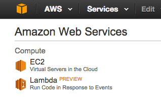
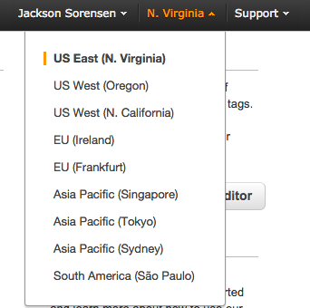
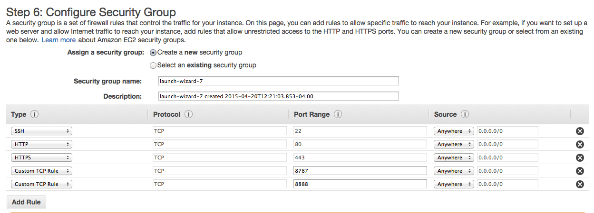
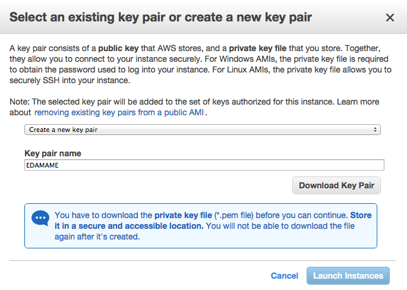

Go to [Amazon Web Services](https://aws.amazon.com) in a web browser.

Select ‘My Account/Console’ menu option ‘AWS Management Console.”


Log in with your username & password. If you are new to _Amazon_ then select **'I am a new user.'** and create an account (NOTE: You do need a credit card, but there is a free tier of usage).

Click on **EC2** (towards the upper left of the page).



#### Step 0:

In the top right of the page between your login name and 'Help' there's a drop down menu with regions.
Select 'US East (N. Virginia)'.



Click on the blue “Launch Instance” button (midway down the page)

#### Step 1:

Select "Community AMIs" and search for EDAMAME and Click the blue "Select" button on the right.


#### Step 2:

Select the appropriate instance type. This depends on the size of the data you are working with.

For the purpose of this workshop we will choose **m3.large**

Select **Next: Configure Instance Details**

#### Step 3:

At this step you can change specfic components of the instance.

For the purposes of this workshop we will not need to change any details.

Select **Next: Add Storage**

#### Step 4:

You can get up to 30 Gb of free storage on an EC2 Instance. If you have a particularly large data set, then you may want to request more data storage space.

For the purposes of this workshop, 30 Gb should be plenty of space for our data files.

Select **Next: Tag Instance**

#### Step 5:

As you become more adept at utilizing EC2 Instances, you may wish to create tags for them.

For the purposes of this workshop we will not need to create a tag of the instance.

Select **Next: Configure Security Group**

#### Step 6:

Here we **will** be making some changes.

1. Name the **Security Group Name** to something you like.  We chose the name EDAMAME for the purposes of this workshop.

2. If you would like to give a description of the Security Group, then please feel free to do so at this time.

3. Next we will be adding some rules to the security group.

* Click on **Add Rule** and select HTTP.

* Click on **Add Rule** and select HTTPS.

* Click on **Add Rule** and select Custom TCP Rule. Change the Port Range to **8787**.

* Click on **Add Rule** and select Custom TCP Rule. Change the Port Range to **8888** .

The Security Group Configuration should look like the image below once you add the above rules.



#### Click on the blue _Review and Launch_ button!

If you would like to, take the time to double check that everything is setup the way you intended.

Once you are sure that the EC2 Instance is set up the way you would like it to be set up, then click on the blue **Launch** button.

#### Key Pair Pop-up

If you already have a key pair and you wish to use it, then select **Choose an existing key pair**, pick your desired key, select the acknowledgement **(making sure you have access to .pem file)** and then click on the blue **Launch Instances** button.

If you do not have an existing key pair or you do not want to use one you already have, then select **Create a new key pair**. Give the key pair a name; the below example's key pair's name is "EDAMAME".

* Click on **Download Key Pair** and save it to a known location.

* Click on the blue **Launch Instances** button.




#### EC2 Dashboard - Instances

At this point you will be brought to your list of Instances on the EC2 Dashboard. The instance you just launched will have a yellow pending circle next to it. When the yellow cirle changes to a green circle, your instance is up and running. In the example below, there are two instances currently running. When you select on by click on the box to the left of the instance, you will see the Instance details appear in the pane below your list of instances.


Locate the Public DNS for your instance. It should look something like this:

```
ec2-**some set of numbers**.compute-1.amazonaws.com.
```

At some point you will need to highlight and copy the Public DNS. This is the link to your specific instance that you started at Amazon Web Services (AWS).


-----------------------------------------------
-----------------------------------------------
